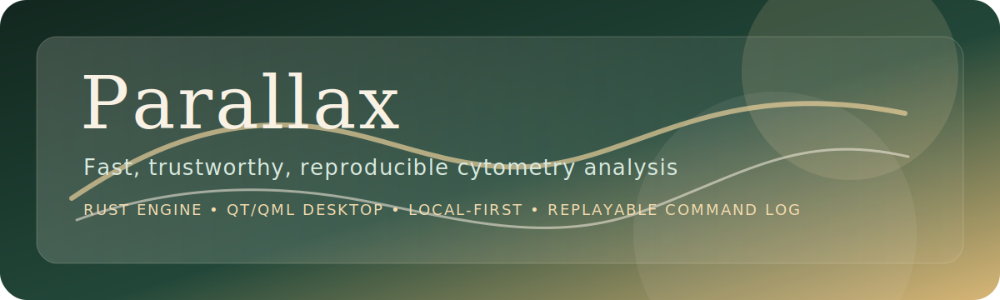

# Parallax

[](https://github.com/felizvida/flowish/actions/workflows/ci.yml)
[](https://github.com/felizvida/flowish/actions/workflows/release.yml)
[](https://github.com/felizvida/flowish/releases)



Parallax is a local-first cytometry workstation built around one shared Rust engine, an explicit command log, and a native Qt/QML desktop. It is designed for teams who care about speed, deterministic results, and a clean handoff between interactive desktop work and reproducible execution.

Today, Parallax is an early but real workstation shell. You can launch the desktop, work against a built-in demo dataset, author rectangle and polygon gates directly on linked scatter plots, inspect the command log, and undo or redo analysis actions through the same replayable state model.

## Why Parallax

- Fast, trustworthy cytometry analysis
- One Rust engine shared across desktop and backend surfaces
- Explicit command-log replay instead of hidden state
- Local-first behavior by default
- A native desktop shell meant to feel precise, not web-like

## Documentation

- [Quick Start](docs/QUICKSTART.md)
- [User Guide](docs/USER_GUIDE.md)
- [Tutorial](docs/TUTORIAL.md)
- [Deployment Guide](docs/DEPLOYMENT.md)
- [Operations Guide](docs/OPERATIONS.md)
- [Release Notes](docs/releases/v0.1.0.md)
- [Architecture Decision Record](docs/architecture/adr-0001-rust-qt-rust-backend.md)

## Current Capabilities

- Deterministic gating and replay in a shared Rust core
- FCS parsing crate for ingestion and metadata inspection
- Qt/QML desktop with live rectangle and polygon gate authoring
- Command log with undo and redo
- Rust backend stub for parity-focused service surfaces
- CLI tools for FCS inspection and replay demos

## Current Limits

- The desktop currently opens with a built-in demo dataset instead of a full import flow
- Gate editing handles, pan/zoom, and saved workspaces are not implemented yet
- Cloud sync, jobs, reporting, and AI assistance are future phases

## Repository Layout

- `crates/flowjoish-core`: deterministic core, command log, gating kernel
- `crates/flowjoish-fcs`: FCS ingestion and metadata parsing on the shared core
- `crates/flowjoish-cli`: CLI for FCS inspection and replay demos
- `crates/flowjoish-desktop-bridge`: Rust FFI bridge for the desktop shell
- `crates/flowjoish-backend`: Rust backend stub for local/cloud parity pressure
- `apps/desktop-qt`: native Qt/QML desktop application

## Build And Run

Run the full test suite:

```bash
cargo test
```

Configure and build the desktop:

```bash
cmake -S apps/desktop-qt -B build/desktop-qt
cmake --build build/desktop-qt
./build/desktop-qt/flowjoish-desktop
```

Describe the backend surface:

```bash
cargo run -p flowjoish-backend -- describe
```

## Community

- [Contributing Guide](CONTRIBUTING.md)
- [Code of Conduct](CODE_OF_CONDUCT.md)
- [Security Policy](SECURITY.md)
- [Support](SUPPORT.md)

## Internal Naming

The repository and crate identifiers still use the `flowjoish-*` naming scheme while the product brand is Parallax. That keeps the codebase stable while we shape the public-facing product and avoids unnecessary churn before packaging and distribution harden.
